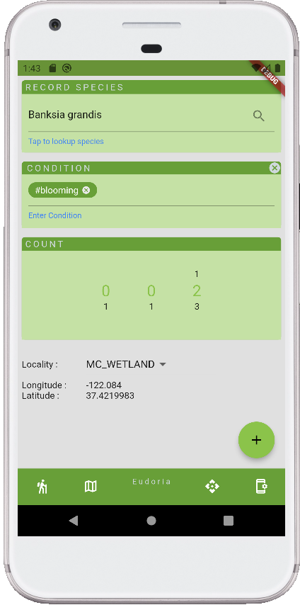
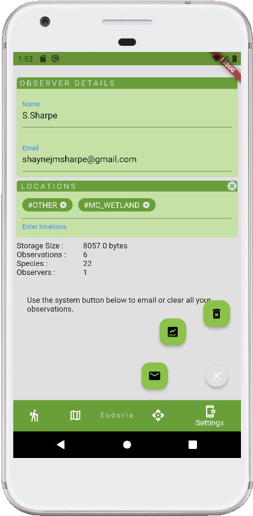
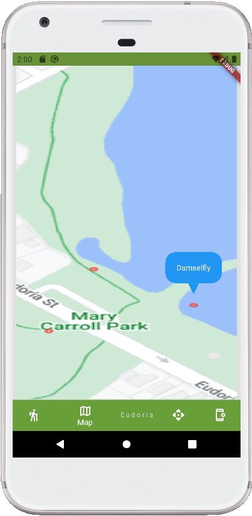
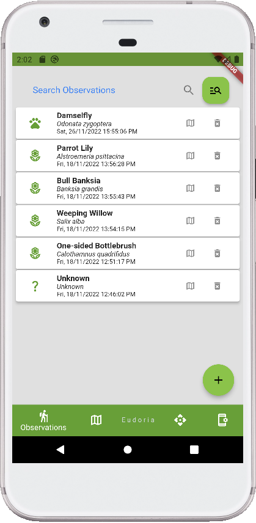

# Eudoria

Eudoria is an application used to record, analyse and share observations taken on field trips.

## About

This project follows the
[simple app state management
tutorial](https://flutter.dev/docs/development/data-and-backend/state-mgmt/simple) as a starting 
point for a Flutter application. The Flutter framework is used to leverage multi-platform
capabilities.

For help getting started with Flutter development, view the
[online documentation](https://flutter.dev/docs), which offers tutorials,
samples, guidance on mobile development, and a full API reference.

## Screens

## Localization

This project generates localized messages based on arb files found in
the `lib/src/localization` directory.

To support additional languages, please visit the tutorial on
[Internationalizing Flutter
apps](https://flutter.dev/docs/development/accessibility-and-localization/internationalization)

## Acknowledgements

Inspirations were drawn from experiences at Mary Carroll Wetland. The park serves as a base point
for personal observations. Thank you Friends Group for expertise, knowledge and morning teas!

## License

[MIT](https://choosealicense.com/licenses/mit/)
